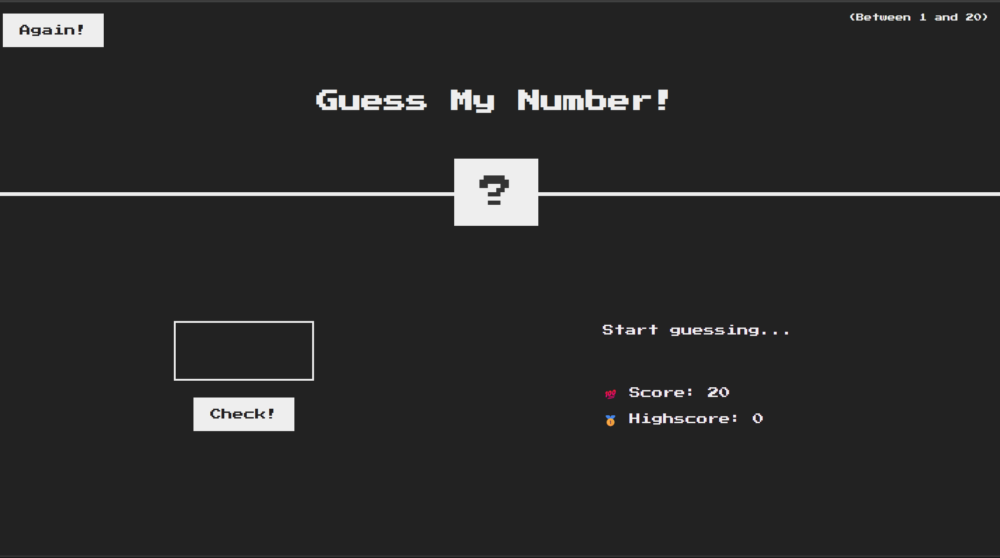
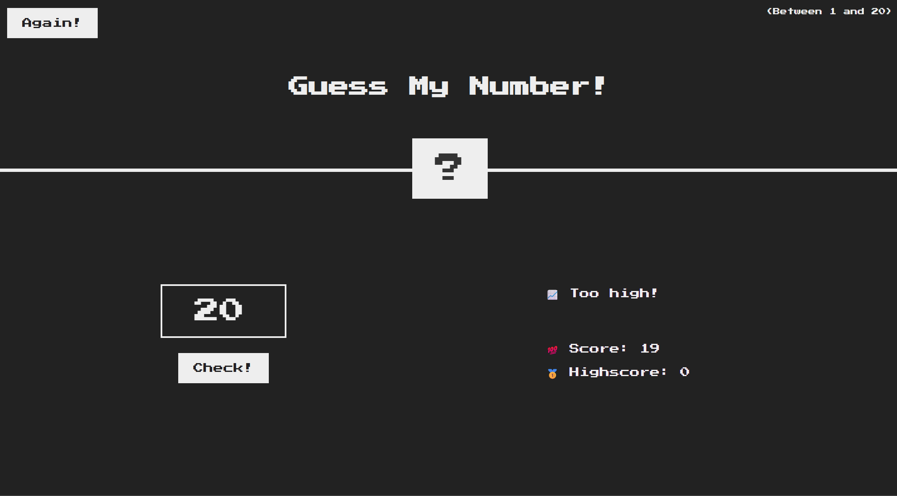
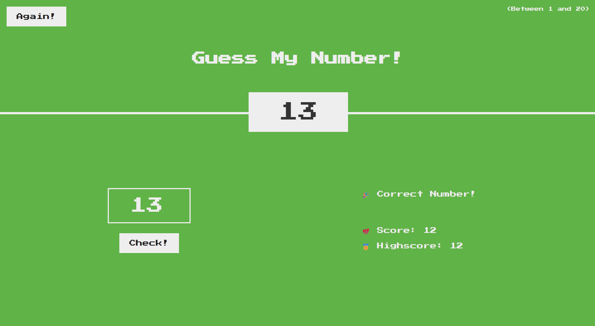

# Guess My Number

A number guessing game to practice events, conditionals, DOM updates, and random numbers.

## Features

- Guess a randomly generated number
- Check and compare user input
- Track score
- Reset game

## Tech Stack

- JavaScript (ES6+)
- HTML & CSS
- DOM & Events

### 📝 Note

This project is part of the **JavaScript Course by Jonas Schmedtmann**.

---

## 🖼️ Screenshots

